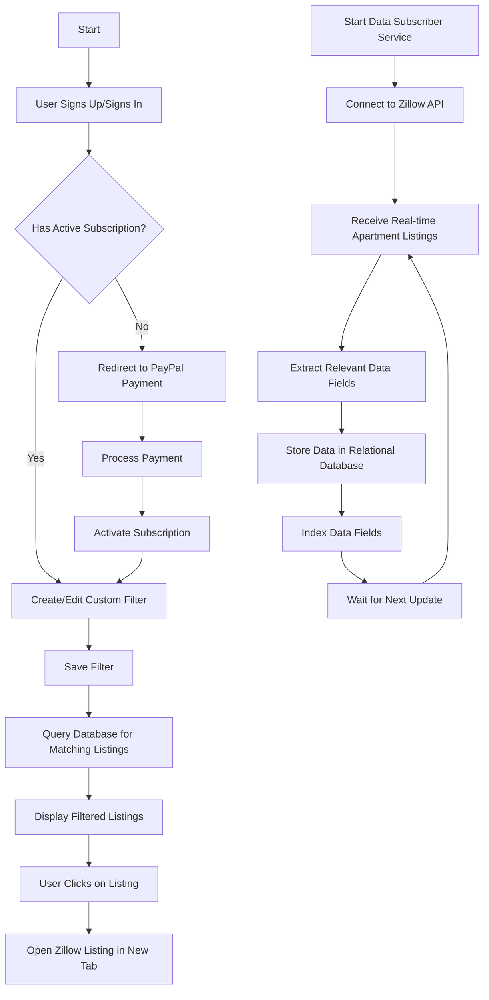
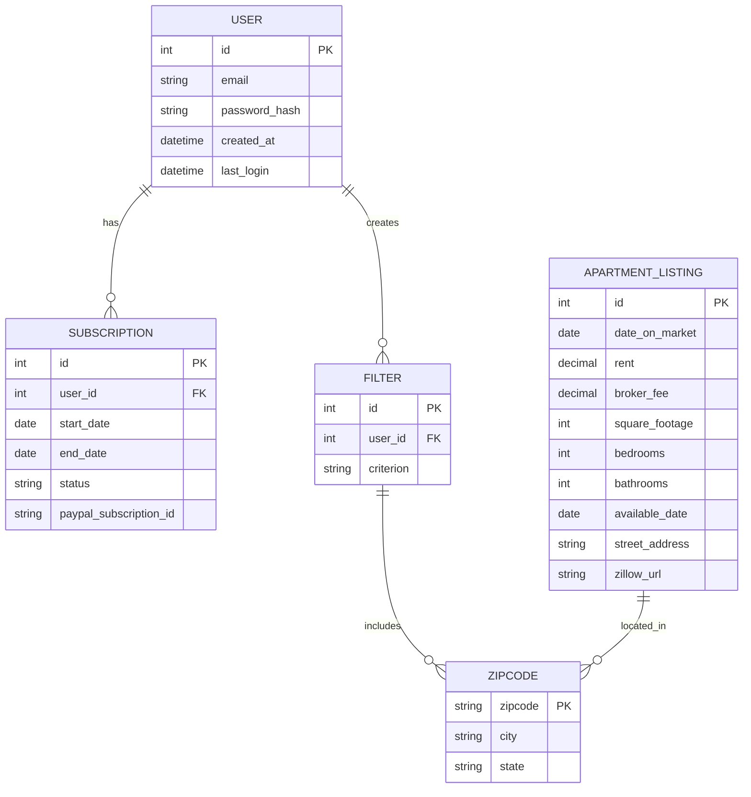
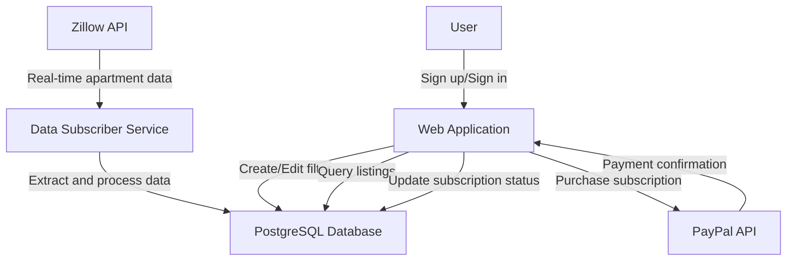

# 1. Introduction

## 1.1 Purpose

The purpose of this Software Requirements Specification (SRS) document is to provide a comprehensive description of the Apartment Finder web service for recent college graduates. This document is intended for use by the development team, project managers, quality assurance testers, and stakeholders involved in the creation and implementation of the system. It serves as a blueprint for the software's functionality, performance requirements, and constraints, ensuring all parties have a clear understanding of the project's objectives and specifications.

## 1.2 Scope

The Apartment Finder web service is designed to assist recent college graduates in finding suitable rental apartments in selected markets. The system consists of two primary subsystems:

1. Apartment Listing Data Subscriber
2. User-facing Web Application

### 1.2.1 Goals

- Provide real-time apartment listing data from Zillow's API for selected markets
- Offer a user-friendly interface for filtering and viewing apartment listings
- Implement a subscription-based model for access to advanced filtering features
- Streamline the apartment search process for recent college graduates

### 1.2.2 Benefits

- Time-saving: Users can quickly find relevant apartment listings based on their specific criteria
- Up-to-date information: Real-time data ensures users have access to the latest listings
- Customization: Personalized filters allow users to focus on apartments that meet their needs
- Convenience: Direct links to Zillow listings provide easy access to detailed information

### 1.2.3 Core Functionalities

1. Apartment Listing Data Subscriber:
   - Subscribe to Zillow's data API for real-time apartment listing updates
   - Extract and store relevant data fields from each listing
   - Maintain a relational database with indexed data fields

2. User-facing Web Application:
   - User authentication system (sign-up and sign-in)
   - Custom filter creation for apartment listings
   - Display of filtered listings in a sortable table format
   - Integration with PayPal for subscription payments
   - Direct linking to Zillow listings for detailed information

The Apartment Finder web service aims to simplify the apartment search process for recent college graduates by providing a streamlined, subscription-based platform with real-time data and customizable filtering options.

# 2. Product Description

## 2.1 Product Perspective

The Apartment Finder web service is a standalone system designed to operate within the broader ecosystem of real estate and rental markets. It interfaces with Zillow's API to obtain real-time apartment listing data and integrates with PayPal for payment processing. The system is comprised of two main subsystems:

1. Apartment Listing Data Subscriber: This backend service interacts with Zillow's API to fetch and process apartment listing data.
2. User-facing Web Application: This frontend application provides the interface for users to interact with the processed data and manage their subscriptions.

The system is designed to be scalable, allowing for future expansion to additional markets and potential integration with other real estate data providers.

## 2.2 Product Functions

The Apartment Finder web service provides the following key functions:

1. Real-time data acquisition from Zillow's API
2. Data processing and storage in a relational database
3. User authentication and account management
4. Custom filter creation for apartment listings
5. Display of filtered apartment listings in a sortable table
6. Subscription management and payment processing via PayPal
7. Direct linking to Zillow listings for detailed information

## 2.3 User Characteristics

The primary users of the Apartment Finder web service are recent college graduates seeking rental apartments. User personas include:

1. New Graduate: 
   - Age: 21-25
   - Education: Bachelor's degree
   - Tech-savvy, comfortable with web applications
   - Limited budget, seeking affordable housing options
   - May be relocating to a new city for work

2. Young Professional:
   - Age: 25-30
   - Education: Bachelor's or Master's degree
   - Career-focused, values time-saving tools
   - Has a steady income, willing to pay for premium services
   - Looking for apartments that balance cost and amenities

Users are expected to have basic computer literacy and familiarity with web-based services. They should be comfortable with online transactions and have access to PayPal for subscription payments.

## 2.4 Constraints

1. Technical Constraints:
   - Reliance on Zillow's API for data accuracy and availability
   - Limited to markets where Zillow provides comprehensive data
   - Database performance may be affected by the volume of real-time data

2. Regulatory Constraints:
   - Compliance with data protection regulations (e.g., GDPR, CCPA)
   - Adherence to fair housing laws and regulations

3. Business Constraints:
   - Subscription-based model may limit initial user adoption
   - Competition from existing real estate platforms and aggregators

4. Operational Constraints:
   - Need for regular updates to maintain compatibility with Zillow's API
   - Requirement for continuous monitoring of data quality and system performance

## 2.5 Assumptions and Dependencies

Assumptions:
1. Zillow's API will remain available and maintain its current data structure
2. Recent college graduates are willing to pay for a specialized apartment finding service
3. Users have access to devices with internet connectivity to use the web application
4. The selected markets have a sufficient volume of apartment listings to provide value to users

Dependencies:
1. Zillow's API for real-time apartment listing data
2. PayPal's payment processing system for subscription management
3. Reliable hosting infrastructure to ensure system availability and performance
4. Third-party libraries and frameworks for web application development and database management
5. Ongoing support and updates from Zillow and PayPal for their respective services

Here's the PROCESS FLOWCHART section of the SRS using Mermaid JS, maintaining consistency with the previously described system:

# 3. Process Flowchart

The following flowchart illustrates the main processes of the Apartment Finder web service:

This flowchart represents the main processes of both subsystems:

1. User-facing Web Application (top section):
   - User authentication
   - Subscription management
   - Filter creation and management
   - Listing display and interaction

2. Apartment Listing Data Subscriber (bottom section):
   - Connection to Zillow API
   - Data extraction and processing
   - Database storage and indexing

The flowchart demonstrates the interconnected nature of the two subsystems, with the Data Subscriber continuously updating the database that the Web Application queries to display filtered listings to users.

Based on the provided information and the existing SRS document, here's a breakdown of the product features with their functional requirements:

# 4. Functional Requirements

## 4.1 Apartment Listing Data Subscriber

### ID: F1
### Description: Real-time data acquisition from Zillow's API
### Priority: High

| Requirement ID | Requirement Description |
|----------------|--------------------------|
| F1.1 | The system shall establish and maintain a connection to Zillow's API |
| F1.2 | The system shall receive real-time apartment listing data for selected markets |
| F1.3 | The system shall handle API rate limits and potential connection issues |
| F1.4 | The system shall log all API interactions for monitoring and debugging purposes |

### ID: F2
### Description: Data extraction and storage
### Priority: High

| Requirement ID | Requirement Description |
|----------------|--------------------------|
| F2.1 | The system shall extract specified data fields from each listing |
| F2.2 | The system shall store extracted data in a relational database |
| F2.3 | The system shall index each collected data field separately |
| F2.4 | The system shall handle data updates for existing listings |

## 4.2 User Authentication and Account Management

### ID: F3
### Description: User registration and authentication
### Priority: High

| Requirement ID | Requirement Description |
|----------------|--------------------------|
| F3.1 | The system shall allow users to sign up with an email and password |
| F3.2 | The system shall implement secure password hashing and storage |
| F3.3 | The system shall provide a sign-in mechanism for registered users |
| F3.4 | The system shall implement session management for authenticated users |

## 4.3 Subscription Management

### ID: F4
### Description: PayPal integration for subscription payments
### Priority: High

| Requirement ID | Requirement Description |
|----------------|--------------------------|
| F4.1 | The system shall integrate with PayPal's API for payment processing |
| F4.2 | The system shall redirect users to PayPal for subscription purchase |
| F4.3 | The system shall handle PayPal payment notifications (IPN) |
| F4.4 | The system shall activate user subscriptions upon successful payment |

## 4.4 Custom Filter Creation and Management

### ID: F5
### Description: Filter creation and storage
### Priority: Medium

| Requirement ID | Requirement Description |
|----------------|--------------------------|
| F5.1 | The system shall allow users to create custom filters with specified criteria |
| F5.2 | The system shall validate filter inputs for correctness and completeness |
| F5.3 | The system shall store user-created filters in the database |
| F5.4 | The system shall allow users to edit and delete their saved filters |

## 4.5 Listing Display and Interaction

### ID: F6
### Description: Display of filtered apartment listings
### Priority: High

| Requirement ID | Requirement Description |
|----------------|--------------------------|
| F6.1 | The system shall query the database for listings matching the user's filter |
| F6.2 | The system shall display filtered listings in a sortable table format |
| F6.3 | The system shall sort listings by default in descending order of listing date |
| F6.4 | The system shall provide direct links to Zillow listings when a row is clicked |

## 4.6 Data Refresh and Synchronization

### ID: F7
### Description: Ensure data consistency and freshness
### Priority: Medium

| Requirement ID | Requirement Description |
|----------------|--------------------------|
| F7.1 | The system shall periodically update the database with new listings from Zillow |
| F7.2 | The system shall remove outdated or unavailable listings from the database |
| F7.3 | The system shall implement a mechanism to handle data conflicts and duplicates |
| F7.4 | The system shall provide a way to manually trigger data refresh if needed |

These functional requirements cover the main features of the Apartment Finder web service, including both the Apartment Listing Data Subscriber and the User-facing Web Application subsystems. The requirements are consistent with the previously described system architecture and technology choices.

# 5. Non-Functional Requirements

## 5.1 Performance

| ID | Requirement |
|----|-------------|
| P1 | The system shall respond to user queries within 2 seconds under normal load conditions |
| P2 | The system shall support at least 1000 concurrent users without degradation in performance |
| P3 | The Apartment Listing Data Subscriber shall process and store new listings within 5 minutes of receiving them from Zillow's API |
| P4 | The database shall support at least 10 million apartment listings while maintaining query response times under 1 second |
| P5 | The web application shall load and render the listing table within 3 seconds for up to 1000 results |

## 5.2 Safety

| ID | Requirement |
|----|-------------|
| S1 | The system shall implement daily automated backups of all user data and apartment listings |
| S2 | The system shall provide a disaster recovery plan with a Recovery Time Objective (RTO) of 4 hours and a Recovery Point Objective (RPO) of 1 hour |
| S3 | The system shall implement input validation to prevent SQL injection and other malicious data entry attempts |
| S4 | The system shall log all critical operations and errors for auditing and troubleshooting purposes |
| S5 | The system shall gracefully degrade functionality in case of third-party service failures (e.g., Zillow API or PayPal) |

## 5.3 Security

| ID | Requirement |
|----|-------------|
| SE1 | The system shall use HTTPS for all communications between the client and server |
| SE2 | User passwords shall be hashed using a strong, industry-standard algorithm (e.g., bcrypt) before storage |
| SE3 | The system shall implement multi-factor authentication for user accounts |
| SE4 | The system shall encrypt all sensitive data at rest, including user personal information and payment details |
| SE5 | The system shall implement role-based access control (RBAC) to restrict access to administrative functions |
| SE6 | The system shall automatically log out inactive users after 30 minutes of inactivity |
| SE7 | The system shall implement rate limiting to prevent brute-force attacks on authentication endpoints |

## 5.4 Quality

### 5.4.1 Availability

| ID | Requirement |
|----|-------------|
| A1 | The system shall maintain 99.9% uptime during peak hours (8 AM to 10 PM local time) |
| A2 | Scheduled maintenance shall be performed during off-peak hours with prior notification to users |

### 5.4.2 Maintainability

| ID | Requirement |
|----|-------------|
| M1 | The system shall be built using modular architecture to facilitate easy updates and maintenance |
| M2 | The system shall use version control (e.g., Git) for all source code and configuration files |
| M3 | The system shall implement automated testing with a minimum of 80% code coverage |

### 5.4.3 Usability

| ID | Requirement |
|----|-------------|
| U1 | The user interface shall be responsive and compatible with major web browsers (Chrome, Firefox, Safari, Edge) |
| U2 | The system shall provide clear error messages and guidance for user actions |
| U3 | The system shall support keyboard navigation for all major functions |

### 5.4.4 Scalability

| ID | Requirement |
|----|-------------|
| SC1 | The system architecture shall support horizontal scaling to handle increased load |
| SC2 | The database shall be designed to support sharding for improved performance as data volume grows |
| SC3 | The system shall use caching mechanisms to reduce database load and improve response times |

### 5.4.5 Reliability

| ID | Requirement |
|----|-------------|
| R1 | The system shall have a Mean Time Between Failures (MTBF) of at least 720 hours |
| R2 | The system shall implement automatic failover for critical components to ensure continuous operation |
| R3 | The system shall maintain data integrity through the use of transactions and data validation |

## 5.5 Compliance

| ID | Requirement |
|----|-------------|
| C1 | The system shall comply with the General Data Protection Regulation (GDPR) for handling user data |
| C2 | The system shall adhere to the California Consumer Privacy Act (CCPA) requirements |
| C3 | The system shall comply with the Fair Housing Act in the display and filtering of apartment listings |
| C4 | The system shall maintain PCI DSS compliance for handling payment information |
| C5 | The system shall provide accessibility features in compliance with WCAG 2.1 Level AA standards |
| C6 | The system shall comply with local and state-specific real estate regulations in the markets it serves |

These non-functional requirements are designed to ensure that the Apartment Finder web service is performant, secure, reliable, and compliant with relevant regulations. They are consistent with the previously described system architecture and technology choices, including the use of a relational database, integration with Zillow's API, and PayPal for payment processing.

# 6. Data Requirements

## 6.1 Data Models

The Apartment Finder web service utilizes a relational database to store apartment listings, user information, and subscription data. The following entity-relationship diagram illustrates the main entities and their relationships:

## 6.2 Data Storage

### 6.2.1 Database Management System

The system will use PostgreSQL as the relational database management system due to its robustness, scalability, and support for complex queries and indexing.

### 6.2.2 Data Retention

- Apartment listings will be retained for 1 year after their last update or until they are marked as unavailable by Zillow's API.
- User account data will be retained for the lifetime of the account and for 30 days after account deletion.
- Subscription data will be retained for 7 years for financial auditing purposes.

### 6.2.3 Data Redundancy and Backup

- The database will be configured with primary-replica replication for high availability.
- Full database backups will be performed daily and stored in a secure, off-site location.
- Transaction logs will be continuously archived to allow point-in-time recovery.

### 6.2.4 Backup and Recovery

- The system will implement automated daily backups of the entire database.
- Incremental backups will be performed hourly during peak usage times.
- A disaster recovery plan will be in place with the following objectives:
  - Recovery Time Objective (RTO): 4 hours
  - Recovery Point Objective (RPO): 1 hour

### 6.2.5 Scalability

- The database will be designed to support horizontal scaling through sharding.
- Partitioning will be implemented for the APARTMENT_LISTING table based on geographical regions to improve query performance.
- Caching mechanisms (e.g., Redis) will be used to reduce database load for frequently accessed data.

## 6.3 Data Processing

### 6.3.1 Data Security

- All sensitive data (e.g., user passwords, payment information) will be encrypted at rest using AES-256 encryption.
- Data in transit will be protected using TLS 1.3 encryption.
- Access to the database will be restricted to authorized personnel and applications using role-based access control (RBAC).
- Regular security audits and penetration testing will be conducted to ensure data protection.

### 6.3.2 Data Flow

The following diagram illustrates the high-level data flow within the Apartment Finder web service:

### 6.3.3 Data Validation and Cleansing

- Input validation will be performed on all user-submitted data to prevent SQL injection and other malicious attempts.
- Data received from Zillow's API will be validated for completeness and consistency before storage.
- A data cleansing process will run periodically to remove duplicate listings and correct any inconsistencies.

### 6.3.4 Data Indexing

The following fields in the APARTMENT_LISTING table will be indexed to optimize query performance:

- date_on_market
- rent
- square_footage
- bedrooms
- bathrooms
- available_date
- zipcode (foreign key)

### 6.3.5 Data Archiving

- Inactive user accounts (no login for 1 year) will be archived to a separate table to improve active database performance.
- Historical listing data older than 1 year will be moved to an archive table for analytical purposes.

### 6.3.6 Data Integration

- The system will implement an ETL (Extract, Transform, Load) process to integrate data from Zillow's API into the PostgreSQL database.
- The ETL process will handle data format differences, resolve conflicts, and ensure data consistency.

This Data Requirements section outlines the key aspects of data management for the Apartment Finder web service, including data models, storage strategies, processing workflows, and security measures. The specifications are consistent with the previously described system architecture and technology choices, such as the use of PostgreSQL for the relational database and integration with Zillow's API and PayPal for payment processing.

# 7. External Interfaces

## 7.1 User Interfaces

The Apartment Finder web service will provide a responsive web-based user interface accessible through modern web browsers. The interface will be designed with a focus on usability and efficiency for recent college graduates.

### 7.1.1 Sign-up and Sign-in Pages

- Clean and minimalistic design with clear input fields for email and password
- Prominent call-to-action buttons for sign-up and sign-in
- Password strength indicator and email validation

### 7.1.2 Dashboard

- Overview of saved filters and subscription status
- Quick access to create new filters or edit existing ones
- Summary of recent listings matching the user's filters

### 7.1.3 Filter Creation/Edit Page

- Intuitive form for selecting zip codes (up to 5) with autocomplete functionality
- Dropdown menus and input fields for setting filter criteria (e.g., rent, square footage, bedrooms)
- Real-time validation of filter inputs

### 7.1.4 Listing Results Table

- Sortable columns for all relevant listing data (date on market, rent, square footage, etc.)
- Pagination controls for navigating through large result sets
- Clickable rows that open the corresponding Zillow listing in a new tab

### 7.1.5 Subscription Management

- Clear display of current subscription status and expiration date
- Easy-to-use interface for initiating or renewing subscriptions via PayPal

[Placeholder for UI mockups]

## 7.2 Hardware Interfaces

As a web-based service, the Apartment Finder does not have direct hardware interfaces. However, it is designed to be compatible with various devices and screen sizes:

- Desktop computers and laptops
- Tablets
- Smartphones

The responsive design will ensure optimal display and functionality across these devices.

## 7.3 Software Interfaces

### 7.3.1 Zillow API

- Interface: RESTful API
- Protocol: HTTPS
- Data Format: JSON
- Authentication: API Key
- Purpose: Retrieve real-time apartment listing data

### 7.3.2 PayPal API

- Interface: RESTful API
- Protocol: HTTPS
- Data Format: JSON
- Authentication: OAuth 2.0
- Purpose: Process subscription payments and manage recurring billing

### 7.3.3 PostgreSQL Database

- Interface: PostgreSQL wire protocol
- Connection: SSL-encrypted
- Purpose: Store and retrieve apartment listings, user data, and subscription information

### 7.3.4 Redis Cache

- Interface: Redis protocol
- Connection: SSL-encrypted
- Purpose: Cache frequently accessed data to improve system performance

## 7.4 Communication Interfaces

### 7.4.1 Web Application to Server Communication

- Protocol: HTTPS
- Port: 443
- Data Format: JSON
- Authentication: JWT (JSON Web Tokens)

### 7.4.2 Server to Database Communication

- Protocol: PostgreSQL wire protocol
- Port: 5432 (default, configurable)
- Security: SSL/TLS encryption

### 7.4.3 Server to Zillow API Communication

- Protocol: HTTPS
- Port: 443
- Data Format: JSON
- Authentication: API Key

### 7.4.4 Server to PayPal API Communication

- Protocol: HTTPS
- Port: 443
- Data Format: JSON
- Authentication: OAuth 2.0

### 7.4.5 Email Notifications

- Protocol: SMTP
- Port: 587 (TLS) or 465 (SSL)
- Security: TLS/SSL encryption
- Purpose: Send account verification, password reset, and subscription-related emails

These external interface specifications are consistent with the previously described system architecture and technology choices, including the use of a web-based application, integration with Zillow's API and PayPal for payment processing, and the use of PostgreSQL as the relational database management system.

# 8. APPENDICES

## 8.1 GLOSSARY

| Term | Definition |
|------|------------|
| Apartment Listing | A detailed description of a rental property, including its features, price, and availability |
| Custom Filter | A set of user-defined criteria used to narrow down apartment search results |
| ETL | Extract, Transform, Load; a process used to collect, process, and store data from various sources |
| Recent College Graduate | An individual who has completed their college education within the past 1-3 years |
| Subscription | A paid service that grants users access to advanced features of the Apartment Finder web service |
| Zillow | A popular online real estate marketplace that provides data on homes and rentals |

## 8.2 ACRONYMS

| Acronym | Expanded Form |
|---------|---------------|
| API | Application Programming Interface |
| CCPA | California Consumer Privacy Act |
| GDPR | General Data Protection Regulation |
| IPN | Instant Payment Notification |
| JWT | JSON Web Token |
| MTBF | Mean Time Between Failures |
| PCI DSS | Payment Card Industry Data Security Standard |
| RBAC | Role-Based Access Control |
| RPO | Recovery Point Objective |
| RTO | Recovery Time Objective |
| SRS | Software Requirements Specification |
| SSL | Secure Sockets Layer |
| TLS | Transport Layer Security |
| WCAG | Web Content Accessibility Guidelines |

## 8.3 ADDITIONAL REFERENCES

1. Zillow API Documentation: [https://www.zillow.com/howto/api/APIOverview.htm](https://www.zillow.com/howto/api/APIOverview.htm)
   - Comprehensive guide to integrating with Zillow's API for real estate data

2. PayPal Developer Documentation: [https://developer.paypal.com/docs/](https://developer.paypal.com/docs/)
   - Resources for implementing PayPal payment processing and subscription management

3. PostgreSQL Documentation: [https://www.postgresql.org/docs/](https://www.postgresql.org/docs/)
   - Official documentation for PostgreSQL database management system

4. Redis Documentation: [https://redis.io/documentation](https://redis.io/documentation)
   - Guide to implementing and optimizing Redis caching

5. OWASP Web Security Testing Guide: [https://owasp.org/www-project-web-security-testing-guide/](https://owasp.org/www-project-web-security-testing-guide/)
   - Best practices for securing web applications

6. WCAG 2.1 Guidelines: [https://www.w3.org/TR/WCAG21/](https://www.w3.org/TR/WCAG21/)
   - Web Content Accessibility Guidelines for creating accessible web applications

7. Fair Housing Act: [https://www.hud.gov/program_offices/fair_housing_equal_opp/fair_housing_act_overview](https://www.hud.gov/program_offices/fair_housing_equal_opp/fair_housing_act_overview)
   - Overview of Fair Housing Act regulations relevant to apartment listings

8. "Building Microservices" by Sam Newman (O'Reilly Media, 2015)
   - Resource for designing and implementing scalable microservices architecture

9. "Clean Code: A Handbook of Agile Software Craftsmanship" by Robert C. Martin (Prentice Hall, 2008)
   - Guide to writing maintainable and efficient code

10. "Designing Data-Intensive Applications" by Martin Kleppmann (O'Reilly Media, 2017)
    - In-depth resource for designing scalable and reliable data systems

These appendices provide additional context and resources for the Apartment Finder web service, maintaining consistency with the previously described system architecture and technology choices, including the use of Zillow's API, PayPal for payment processing, PostgreSQL as the relational database, and Redis for caching.