# 1. Introduction

## 1.1 System Overview

The Apartment Finder web service is a comprehensive solution designed to assist recent college graduates in finding suitable rental apartments. The system consists of two primary subsystems working in tandem to provide a seamless apartment search experience:

1. Apartment Listing Data Subscriber: This backend service interfaces with Zillow's API to continuously fetch and process real-time apartment listing data for selected markets. It extracts relevant information from each listing and stores it in a PostgreSQL database for efficient querying.

2. User-facing Web Application: This frontend application provides an intuitive interface for users to create custom filters, view filtered apartment listings, and manage their subscriptions. It integrates with PayPal for secure payment processing and subscription management.

The system architecture is designed to be scalable, maintainable, and secure, utilizing modern web technologies and best practices. The following diagram illustrates the high-level system architecture:

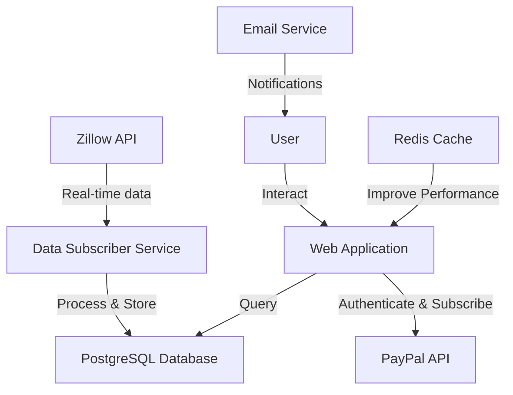

## 1.2 Scope

### 1.2.1 Goals

The Apartment Finder web service aims to:

1. Simplify the apartment search process for recent college graduates
2. Provide up-to-date and accurate apartment listing information
3. Offer customizable filtering options to match user preferences
4. Deliver a user-friendly and responsive web interface
5. Ensure data security and user privacy

### 1.2.2 Benefits

- Time-saving: Users can quickly find relevant apartment listings based on their specific criteria
- Real-time data: Integration with Zillow's API ensures access to the latest apartment listings
- Customization: Personalized filters allow users to focus on apartments that meet their needs
- User-friendly: Intuitive interface designed specifically for recent college graduates
- Secure: Implements best practices in data protection and user privacy

### 1.2.3 Core Functionalities

| Functionality | Description |
|---------------|-------------|
| Real-time data acquisition | Continuously fetch and process apartment listing data from Zillow's API |
| User authentication | Secure sign-up and sign-in processes for user accounts |
| Custom filter creation | Allow users to create and save personalized apartment search filters |
| Listing display | Present filtered apartment listings in a sortable and easy-to-read format |
| Subscription management | Integration with PayPal for secure subscription purchases and renewals |
| Direct Zillow linking | Provide quick access to detailed listing information on Zillow's website |

The Apartment Finder web service is designed to be a comprehensive solution for recent college graduates seeking rental apartments. By leveraging real-time data from Zillow, implementing a user-friendly interface, and offering customizable search options, the system aims to streamline the apartment hunting process and provide value to its users.

# SYSTEM ARCHITECTURE

## PROGRAMMING LANGUAGES

The Apartment Finder web service will utilize the following programming languages:

| Language | Purpose | Justification |
|----------|---------|---------------|
| Python | Backend development | - Excellent for rapid development<br>- Rich ecosystem of libraries for web development and data processing<br>- Strong support for API integrations (Zillow, PayPal)<br>- Scalable and maintainable |
| JavaScript (Node.js) | Backend development | - Asynchronous nature suits real-time data processing<br>- Efficient for handling concurrent connections<br>- Seamless JSON parsing for API interactions |
| TypeScript | Frontend development | - Adds static typing to JavaScript, improving code quality and maintainability<br>- Enhanced tooling and IDE support<br>- Easier to scale and refactor large codebases |
| SQL | Database queries | - Standard language for relational database interactions<br>- Powerful for complex queries and data manipulation |
| HTML5/CSS3 | Frontend markup and styling | - Industry standard for web content structure and presentation<br>- Ensures cross-browser compatibility and responsive design |

## HIGH-LEVEL ARCHITECTURE DIAGRAM

The following diagram provides an overview of the Apartment Finder web service's high-level architecture:

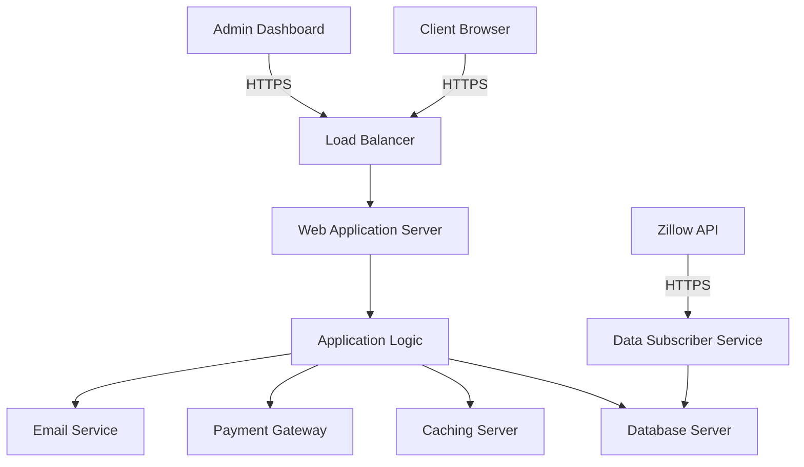

## COMPONENT DIAGRAMS

### Web Application Components

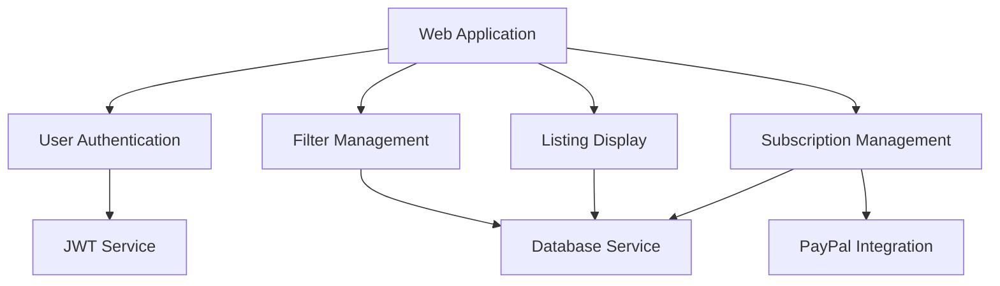

### Data Subscriber Components

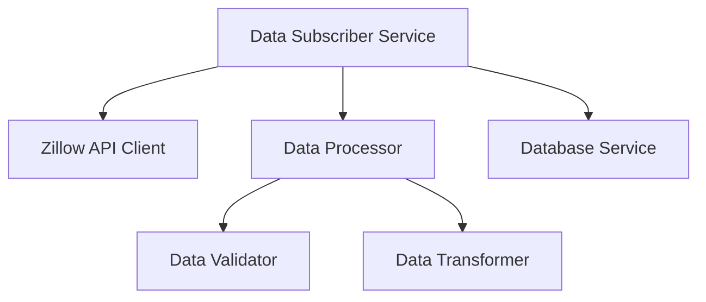

## SEQUENCE DIAGRAMS

### User Authentication Flow

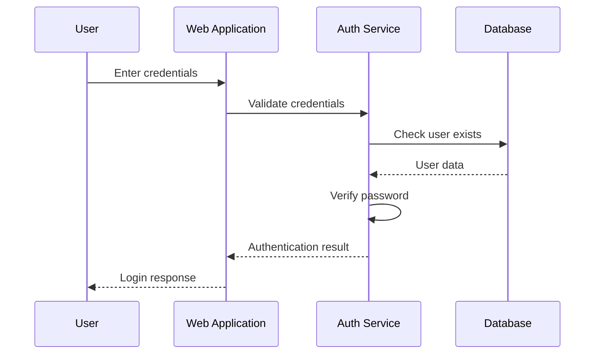

### Apartment Listing Search Flow

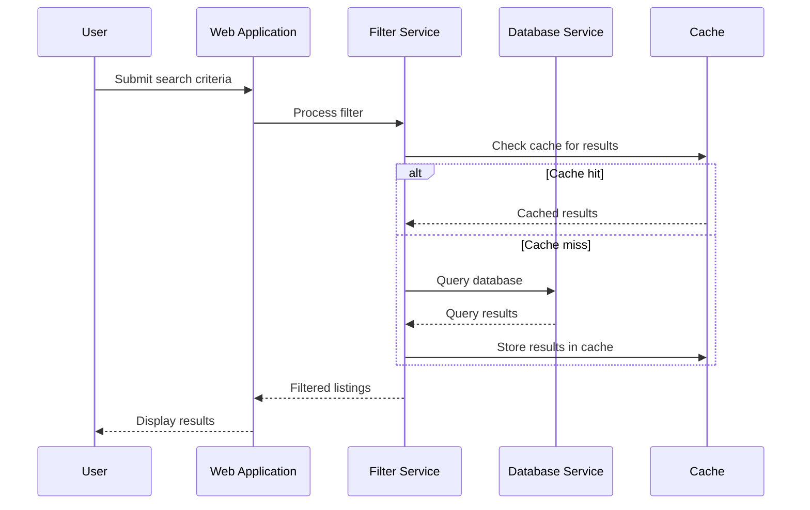

## DATA-FLOW DIAGRAM

The following diagram illustrates how data flows through the Apartment Finder system:

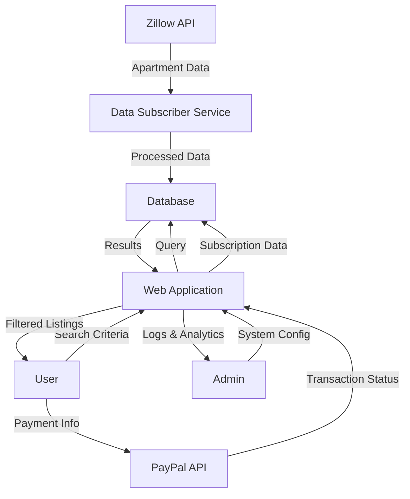

This data flow diagram shows:
1. How apartment data is acquired from Zillow and stored in the database
2. The user interaction flow for searching listings
3. The payment process for subscriptions
4. Administrative functions for system management and monitoring

The system architecture described here is consistent with the previously mentioned technology choices, including the use of a relational database (PostgreSQL), integration with Zillow's API and PayPal for payment processing, and the implementation of caching mechanisms (Redis) for improved performance.

# SYSTEM DESIGN

## PROGRAMMING LANGUAGES

The Apartment Finder web service will utilize the following programming languages:

| Language | Purpose | Justification |
|----------|---------|---------------|
| Python | Backend development | - Excellent for rapid development<br>- Rich ecosystem of libraries for web development and data processing<br>- Strong support for API integrations (Zillow, PayPal)<br>- Scalable and maintainable |
| JavaScript (Node.js) | Backend development | - Asynchronous nature suits real-time data processing<br>- Efficient for handling concurrent connections<br>- Seamless JSON parsing for API interactions |
| TypeScript | Frontend development | - Adds static typing to JavaScript, improving code quality and maintainability<br>- Enhanced tooling and IDE support<br>- Easier to scale and refactor large codebases |
| SQL | Database queries | - Standard language for relational database interactions<br>- Powerful for complex queries and data manipulation |
| HTML5/CSS3 | Frontend markup and styling | - Industry standard for web content structure and presentation<br>- Ensures cross-browser compatibility and responsive design |

## DATABASE DESIGN

The Apartment Finder web service will use PostgreSQL as the relational database management system. The database schema is designed to efficiently store and retrieve apartment listings, user information, and subscription data.

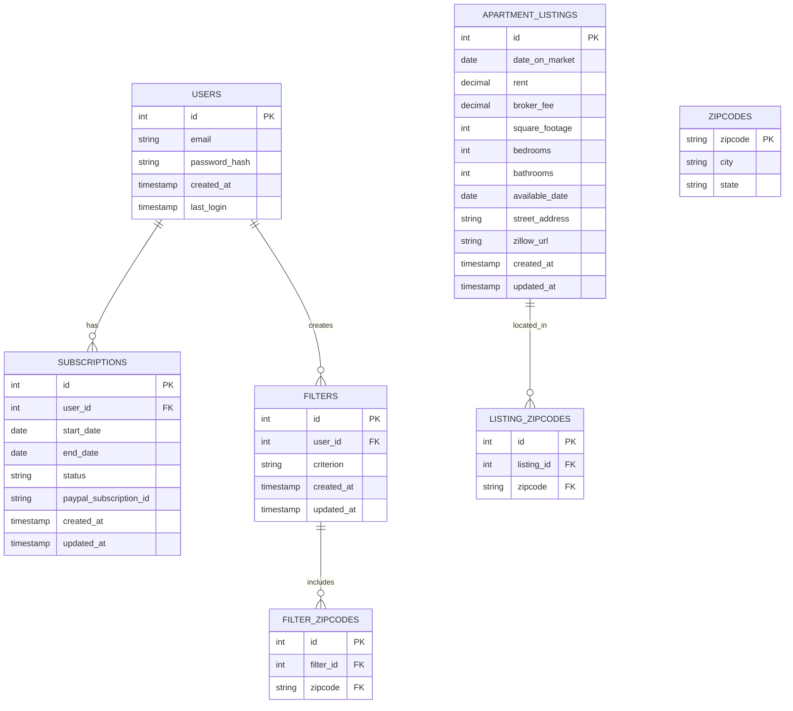

## API DESIGN

The Apartment Finder web service will implement a RESTful API for communication between the frontend and backend, as well as for integrating with external services.

### Internal API Endpoints

| Endpoint | Method | Description |
|----------|--------|-------------|
| `/api/auth/signup` | POST | User registration |
| `/api/auth/login` | POST | User authentication |
| `/api/filters` | GET, POST | Retrieve and create filters |
| `/api/filters/:id` | GET, PUT, DELETE | Manage specific filters |
| `/api/listings` | GET | Retrieve filtered apartment listings |
| `/api/subscriptions` | GET, POST | Manage user subscriptions |

### External API Integrations

1. Zillow API
   - Endpoint: `https://api.zillow.com/v2/listings`
   - Method: GET
   - Purpose: Fetch real-time apartment listing data

2. PayPal API
   - Endpoint: `https://api.paypal.com/v1/billing/subscriptions`
   - Method: POST
   - Purpose: Create and manage user subscriptions

## USER INTERFACE DESIGN

The Apartment Finder web application will feature a clean, intuitive, and responsive user interface. Here are markdown wireframe mockups for key pages:

### Home Page
```
+----------------------------------+
|  Logo   [Login] [Sign Up]        |
+----------------------------------+
|                                  |
|  Find Your Perfect Apartment     |
|                                  |
|  [Create Account to Get Started] |
|                                  |
|  Featured Listings:              |
|  +--------+  +--------+          |
|  | Apt 1  |  | Apt 2  |          |
|  +--------+  +--------+          |
|                                  |
+----------------------------------+
|  Footer: About | Contact | Terms |
+----------------------------------+
```

### Dashboard
```
+----------------------------------+
|  Logo   [Filters] [Account] [Logout]
+----------------------------------+
|  Welcome, [User]!                |
|                                  |
|  Your Filters:                   |
|  +----------------------------+  |
|  | Filter 1 | Edit | Delete   |  |
|  +----------------------------+  |
|  | Filter 2 | Edit | Delete   |  |
|  +----------------------------+  |
|                                  |
|  [Create New Filter]             |
|                                  |
|  Recent Listings:                |
|  +----------------------------+  |
|  | Listing 1 | View Details   |  |
|  +----------------------------+  |
|  | Listing 2 | View Details   |  |
|  +----------------------------+  |
|                                  |
+----------------------------------+
```

### Filter Creation Page
```
+----------------------------------+
|  Logo   [Dashboard] [Account]    |
+----------------------------------+
|  Create New Filter               |
|                                  |
|  Zip Codes:                      |
|  [       ] [Add] (max 5)         |
|                                  |
|  Rent Range:                     |
|  $[    ] to $[    ]              |
|                                  |
|  Bedrooms:                       |
|  [1+] [2+] [3+] [4+]             |
|                                  |
|  Bathrooms:                      |
|  [1+] [1.5+] [2+] [2.5+]         |
|                                  |
|  Square Footage:                 |
|  [    ] to [    ]                |
|                                  |
|  [Save Filter]                   |
|                                  |
+----------------------------------+
```

## THEME DESIGN

The Apartment Finder web service will adopt a modern, clean, and user-friendly design theme that appeals to recent college graduates. The color scheme and styling will reflect professionalism while maintaining a fresh and approachable look.

### Color Palette

- Primary Color: #4A90E2 (Blue) - Represents trust and professionalism
- Secondary Color: #50E3C2 (Teal) - Adds a fresh and modern touch
- Accent Color: #F5A623 (Orange) - For call-to-action elements
- Background Color: #F8F8F8 (Light Gray) - Ensures readability and clean layout
- Text Color: #333333 (Dark Gray) - For main content
- White: #FFFFFF - For contrast and highlighting

### Typography

- Headings: Roboto, sans-serif (Bold)
- Body Text: Open Sans, sans-serif (Regular)
- Font Sizes:
  - H1: 32px
  - H2: 24px
  - H3: 18px
  - Body: 16px
  - Small Text: 14px

### UI Elements

- Buttons:
  - Primary: Filled with primary color (#4A90E2)
  - Secondary: Outlined with secondary color (#50E3C2)
  - Call-to-action: Filled with accent color (#F5A623)
- Forms:
  - Input fields with subtle borders and focus states
  - Clear labels and placeholder text
- Cards:
  - For displaying apartment listings and user filters
  - Subtle box shadow for depth
- Icons:
  - Line icons for a clean and modern look
  - Consistent style throughout the application

### Responsive Design

- Fluid grid system for adapting to different screen sizes
- Mobile-first approach to ensure compatibility across devices
- Breakpoints:
  - Mobile: Up to 767px
  - Tablet: 768px to 1023px
  - Desktop: 1024px and above

This theme design aims to create a visually appealing and user-friendly interface that aligns with the preferences and expectations of recent college graduates while maintaining a professional appearance suitable for a real estate-related web service.

# TECHNOLOGY STACK

## PROGRAMMING LANGUAGES

The Apartment Finder web service will utilize the following programming languages:

| Language | Purpose | Justification |
|----------|---------|---------------|
| Python | Backend development | - Excellent for rapid development<br>- Rich ecosystem of libraries for web development and data processing<br>- Strong support for API integrations (Zillow, PayPal)<br>- Scalable and maintainable |
| JavaScript | Frontend development | - Industry standard for interactive web applications<br>- Wide range of frameworks and libraries available<br>- Supports both server-side (Node.js) and client-side development |
| TypeScript | Frontend development | - Adds static typing to JavaScript, improving code quality and maintainability<br>- Enhanced tooling and IDE support<br>- Easier to scale and refactor large codebases |
| SQL | Database queries | - Standard language for relational database interactions<br>- Powerful for complex queries and data manipulation |
| HTML5/CSS3 | Frontend markup and styling | - Industry standard for web content structure and presentation<br>- Ensures cross-browser compatibility and responsive design |

## FRAMEWORKS AND LIBRARIES

The following frameworks and libraries will be used in the development of the Apartment Finder web service:

| Framework/Library | Purpose | Justification |
|-------------------|---------|---------------|
| Django | Backend web framework | - Robust, scalable, and secure<br>- Built-in admin interface<br>- ORM for database interactions<br>- Excellent documentation and community support |
| React | Frontend UI library | - Component-based architecture for reusable UI elements<br>- Virtual DOM for efficient rendering<br>- Large ecosystem of third-party components |
| Redux | State management | - Predictable state management for complex applications<br>- Integrates well with React<br>- Facilitates easier debugging and testing |
| Axios | HTTP client | - Promise-based HTTP client for browser and Node.js<br>- Simplifies API requests and response handling |
| Celery | Task queue | - Distributed task queue for handling background jobs<br>- Integrates well with Django for asynchronous tasks |
| Pytest | Testing framework | - Comprehensive testing framework for Python<br>- Supports both unit and integration testing |
| Jest | JavaScript testing | - Feature-rich testing framework for JavaScript<br>- Works well with React and TypeScript |
| Bootstrap | CSS framework | - Responsive design out of the box<br>- Consistent UI components<br>- Customizable themes |

## DATABASES

The Apartment Finder web service will employ the following database systems:

| Database | Purpose | Justification |
|----------|---------|---------------|
| PostgreSQL | Primary relational database | - Robust and scalable RDBMS<br>- Strong support for complex queries and indexing<br>- JSONB support for flexible data storage<br>- Excellent performance for large datasets |
| Redis | Caching and session storage | - In-memory data structure store for fast read/write operations<br>- Supports various data structures<br>- Ideal for caching and real-time data processing |

## THIRD-PARTY SERVICES

The following external services and APIs will be integrated into the Apartment Finder web service:

| Service | Purpose | Justification |
|---------|---------|---------------|
| Zillow API | Real-time apartment listing data | - Comprehensive and up-to-date real estate data<br>- Well-documented API with reliable support |
| PayPal API | Payment processing and subscription management | - Widely trusted payment gateway<br>- Supports recurring billing for subscriptions<br>- Robust security measures and fraud protection |
| Amazon S3 | Static file and image storage | - Scalable and cost-effective cloud storage<br>- High availability and durability<br>- Easy integration with web applications |
| SendGrid | Email notifications | - Reliable email delivery service<br>- Templating support for consistent email design<br>- Analytics for tracking email performance |
| Google Maps API | Geolocation and mapping services | - Industry-standard mapping service<br>- Provides geocoding and reverse geocoding<br>- Allows for interactive maps in the application |

## TECHNOLOGY STACK DIAGRAM

The following diagram illustrates the overall technology stack of the Apartment Finder web service:

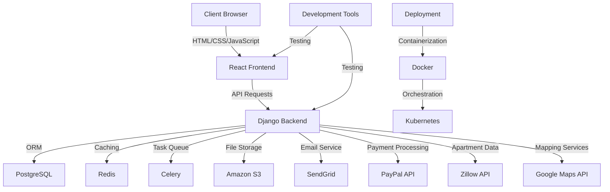

This technology stack is designed to provide a robust, scalable, and maintainable solution for the Apartment Finder web service. It leverages industry-standard technologies and frameworks to ensure efficient development, reliable performance, and ease of future enhancements.

# SECURITY CONSIDERATIONS

## AUTHENTICATION AND AUTHORIZATION

The Apartment Finder web service will implement a robust authentication and authorization system to ensure secure access to user accounts and protected resources.

### Authentication

1. User Registration:
   - Users will register with a valid email address and a strong password.
   - Passwords must meet the following criteria:
     - Minimum length of 12 characters
     - Combination of uppercase and lowercase letters, numbers, and special characters
   - Email verification will be required to activate the account.

2. Multi-Factor Authentication (MFA):
   - Optional but strongly encouraged for all users.
   - Implemented using Time-based One-Time Passwords (TOTP) via authenticator apps.

3. Login Process:
   - Users will authenticate using their email and password.
   - Failed login attempts will be limited to 5 within a 15-minute window to prevent brute-force attacks.
   - Successful logins will generate a JSON Web Token (JWT) for subsequent API requests.

4. Password Reset:
   - Secure password reset mechanism using time-limited, single-use tokens sent via email.
   - Requires verification of the user's email address before allowing password changes.

### Authorization

The system will implement Role-Based Access Control (RBAC) to manage user permissions:

| Role | Permissions |
|------|-------------|
| Guest | - View public pages<br>- Register for an account |
| User | - Create and manage filters<br>- View apartment listings<br>- Manage own profile |
| Subscriber | - All User permissions<br>- Access premium features |
| Admin | - All Subscriber permissions<br>- Manage user accounts<br>- Access system analytics |

Authorization flow:

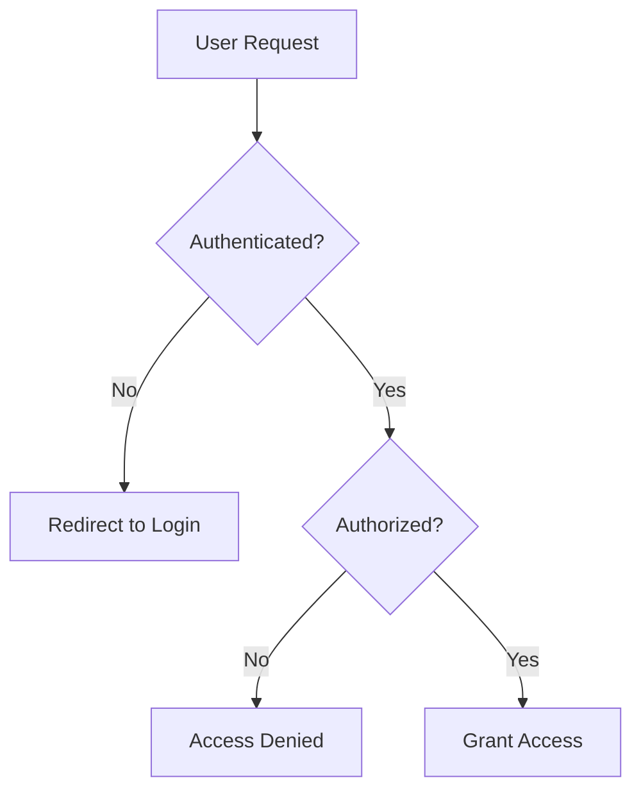

## DATA SECURITY

To protect sensitive user information and maintain data integrity, the following measures will be implemented:

1. Encryption:
   - All data in transit will be encrypted using TLS 1.3.
   - Sensitive data at rest (e.g., passwords, payment information) will be encrypted using AES-256.

2. Database Security:
   - PostgreSQL will be configured with strong access controls and encryption.
   - Regular security patches and updates will be applied.

3. API Security:
   - API endpoints will be protected using JWT authentication.
   - Rate limiting will be implemented to prevent abuse.

4. Data Minimization:
   - Only necessary user data will be collected and stored.
   - Personal data will be anonymized or pseudonymized where possible.

5. Secure File Storage:
   - User-uploaded files (if applicable) will be stored in Amazon S3 with appropriate access controls.

6. Data Backup and Recovery:
   - Regular automated backups of the database will be performed.
   - Backup data will be encrypted and stored in a secure, off-site location.

7. Data Retention and Deletion:
   - Clear policies for data retention periods will be established.
   - Secure data deletion procedures will be implemented for user account termination.

## SECURITY PROTOCOLS

The following security protocols and standards will be implemented to maintain overall system security:

1. Secure Development Lifecycle:
   - Regular security training for development team members.
   - Code reviews with a focus on security best practices.
   - Static and dynamic code analysis tools integrated into the CI/CD pipeline.

2. Vulnerability Management:
   - Regular vulnerability scans of the application and infrastructure.
   - Timely application of security patches and updates.
   - Participation in a responsible disclosure program for external security researchers.

3. Incident Response Plan:
   - Documented procedures for detecting, responding to, and mitigating security incidents.
   - Regular testing and updating of the incident response plan.

4. Logging and Monitoring:
   - Comprehensive logging of system events, user actions, and security-related incidents.
   - Real-time monitoring and alerting for suspicious activities.
   - Log retention for a minimum of 1 year for auditing purposes.

5. Third-Party Security:
   - Regular security assessments of third-party integrations (e.g., Zillow API, PayPal).
   - Contractual agreements with third-party providers to maintain security standards.

6. Compliance:
   - Adherence to relevant data protection regulations (e.g., GDPR, CCPA).
   - Regular security audits and penetration testing by external security firms.

7. Physical Security:
   - Secure hosting environment with restricted physical access.
   - Multi-factor authentication for administrative access to production systems.

8. Network Security:
   - Implementation of Web Application Firewall (WAF) to protect against common web attacks.
   - Regular network penetration testing and vulnerability assessments.

Security Measures Overview:

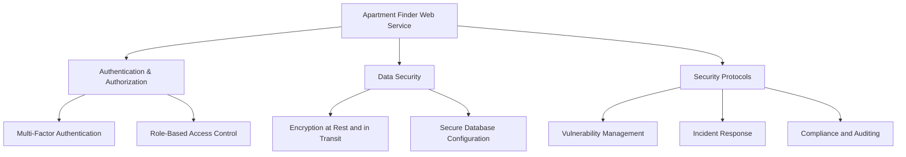

These security considerations are designed to protect the Apartment Finder web service, its users, and their data from potential threats while maintaining consistency with the previously described system architecture and technology choices, including the use of PostgreSQL for the database, integration with Zillow's API and PayPal for payment processing, and the implementation of a web-based application.